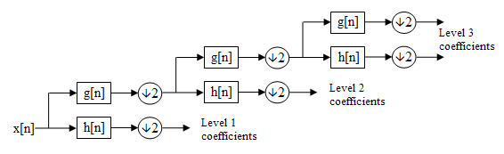

# Learning Wavelets

### Austen Lamacraft, Cavendish Lab

# Learning Representations

### Word Vectors

---

### Autoencoder

Latent space ($z$-variables) encodes inputs

# Challenge of Audio

Audio CD sampling rate 44.1 kHz

# Multiscale Methods

### Example: Fast Fourier Transform

---

### Dilated Convolutions in DeepMind's WaveNet

# Wavelets

---

---

---

# A Different Approach?

# Some Recent Work

Recoskie & Mann arXiv:1802.02961 [no exact reconstruction]

# Project structure

- A simple dataset e.g. [Google's NSynth](https://magenta.tensorflow.org/datasets/nsynth)
- A deep learning framework (TensorFlow, PyTorch)
- An objective function (sparseness, perceptual similarity)
- Use of GPU cluster
